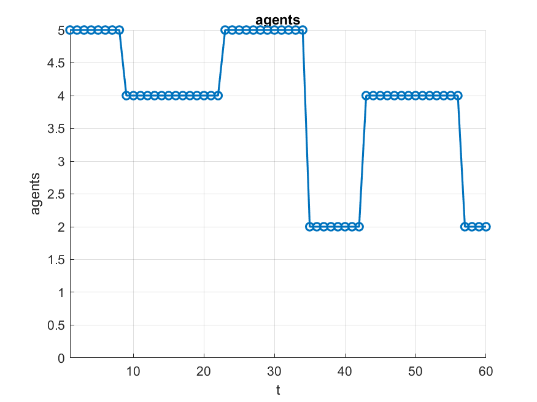
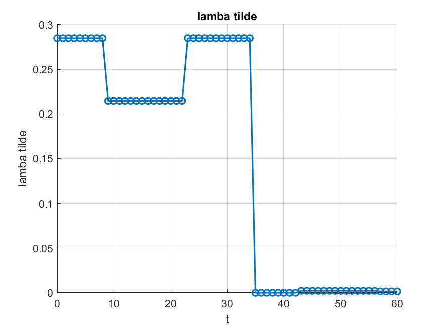

# Analysis and Control of Multi-Robot Systems

This repository provides MATLAB code to **simulate biconnectivity levels** in multi-agent formations, inspired by the approach described in the paper:  
👉 [https://ieeexplore.ieee.org/abstract/document/10886012](https://ieeexplore.ieee.org/abstract/document/10886012)

The simulation models how the **algebraic biconnectivity** and the team formation evolve when agents are dynamically **added** or **removed** through discrete events. This allows testing robustness of the team’s communication graph under disturbances and scheduling changes.

---

## Main Parameters

- **`formation_type`** (`1`, `2`, `3`): selects the initial formation.
  - `1` → 4 vertices + center: `[-l,-l; l,-l; l,l; -l,l; 0,0]`
  - `2` → cross (center + midpoints of edges): `[0,0; 0,-l; 0,l; l,0; -l,0]`
  - `3` → 4 vertices + center + midpoints of edges: `[-l,-l; l,-l; l,l; -l,l; 0,0; 0,-l; 0,l; l,0; -l,0]`
- **`l`** (`1`, `1.2`, `1.5`): half side of the square (scale of the formation).
- **`formations`**: cell array containing the three possible 2D structures (parameterized by `l`).
- **`robotPosition`**: the actual formation chosen, set as `robotPosition = formations{formation_type}`.
- **`N_max`**: maximum number of agents in the initial formation, `size(robotPosition,1)`.
- **`max_event`**: maximum number of random events (e.g., agents leaving/joining) during the simulation horizon.
- **`max_change`**: maximum number of changes per event (how many agents are involved in a single event).
- **`gen_random_events(N_max, rng_seed, T_end, max_event, max_change)`** → generates:
  - `event_time`: timestamps of events on `[0, T_end]`
  - `event_type`: type of event (e.g., join/leave)
  - `event_agent`: agents involved
  - `history_n_agent`: time history of the number of active agents

## Plot

- Plots are saved in a subfolder:  
  `plot/formation_<formation_type>_<l_formatted>`  
  where `l_formatted` uses **2 decimal digits** (e.g., `1.50`).  
- Generated files:
  - `formation.png` — evolution of the formation
  - `lambda2tilde.png` — biconnectivity metric \(\tilde{\lambda}_2\)
  - `agents.png` — number of active agents over time

## Example Plots

Below are some example results. Each row corresponds to a different folder:

1. `plot/formation_1_1.00`
2. `plot/formation_2_1.00`
3. `plot/formation_3_1.00`
4. `plot/formation_3_1.50`

Each row shows the three generated figures: **formation**, **lambda2tilde**, **agents**.

| Formation | Lambda2tilde | Agents |
|-----------|--------------|--------|
|  |  |  |
|  |  |  |
|  |  |  |
|  |  |  |
